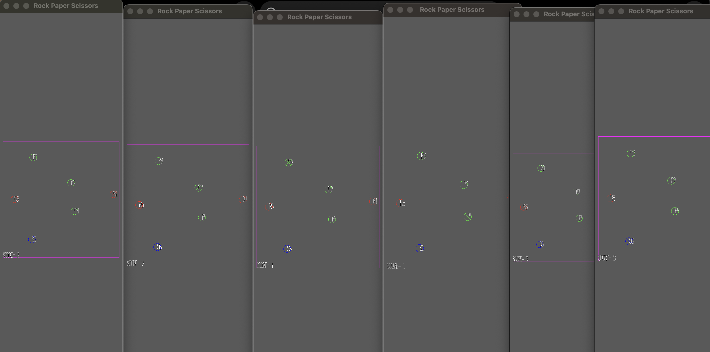

# Rock Paper Scissors

Author: Charvi Hoysal

Design: Giant Rock Paper Scissors Arena game! Hit the right type of player to increase your score, and run from the other!

Credits: 
Conceptual help about where/how the code is sending and receiving information as well as a few other things from Taylor Kynard. Was able to breifly look through how she was doing it in her code, but what I ended up doing was different.

Networking: 
My client/server multiplayer is very similar to that of the base code.
In Game.hpp, in the player class, I added a game state variable, uint8_t score.
In Game.cpp send_state_message, I am adding an additional byte to the message which is just the score (since its 8 bits, no need to bit manipulate).
so the state message looks like this now:
position, velocity, color, score, name
Subsequently, I edited recv_state_message to reflect this change, reading the score variable as well.
The state message is sent and received between client and server to communicate and update the scores / positions / velocities of all the players on the server
And the player can only see their own score on their own connection

Screen Shot:

How To Play:

Each player randomly spawns in as either rock(red), paper(green), or scissors(blue). This will also be noted by the letter next to the player number (ex P1, R2, S3).
Rock beats Scissors
Scissors beats Paper
Paper beats Rock
Move around the Arena with WASD to chase and run from other players.
If you hit someone and win, you will gain a point
If you get hit and lose, you will lose a point (0 is minimum score), and you will change type

Sources: All assets in the base code

This game was built with [NEST](NEST.md).

